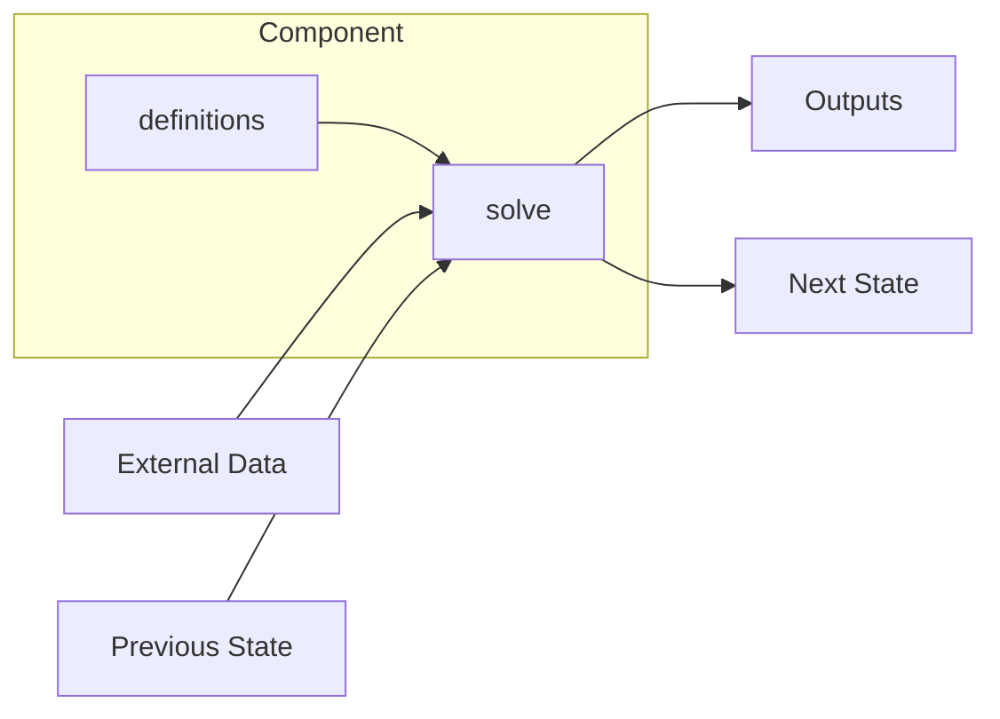
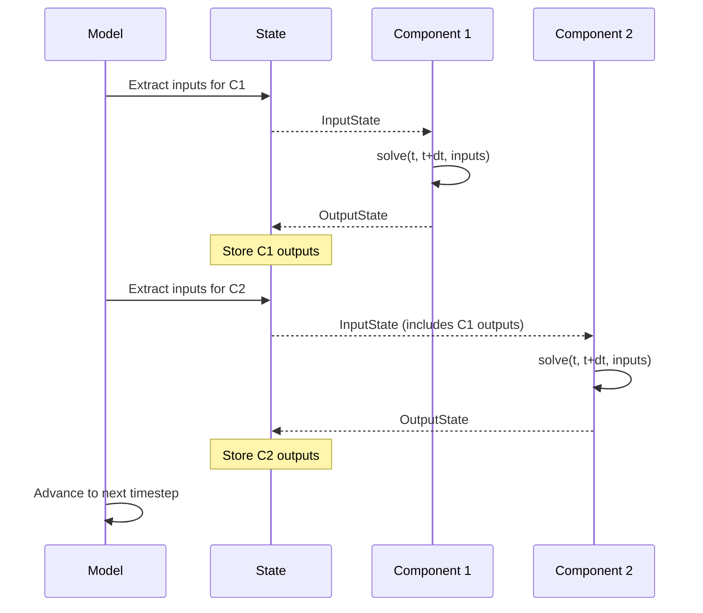
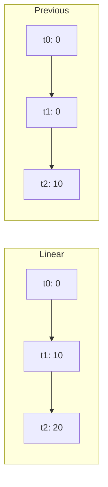
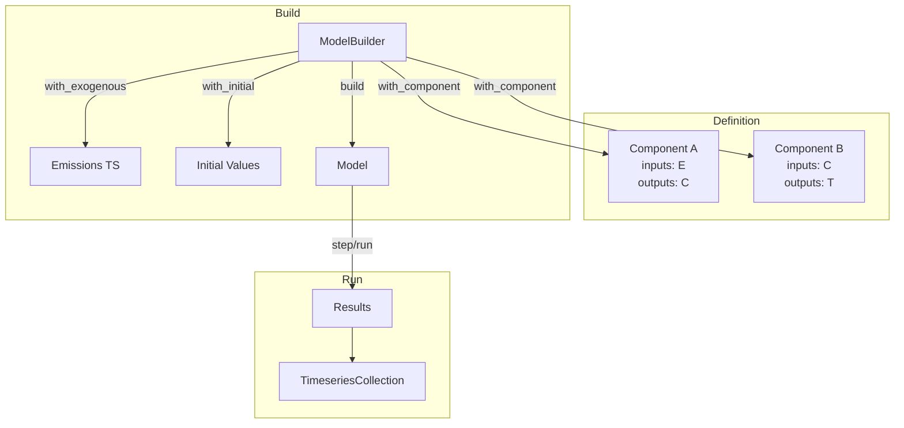

# Key Concepts

This page explains the core abstractions in RSCM: **Components**, **Models**, and **Timeseries**.

## Components

Components are the fundamental building blocks of RSCM.
Each component encapsulates a specific piece of physics (e.g., carbon cycle, radiative forcing, temperature response) that can be solved for a given timestep.

### What Components Do

A component:

- **Declares requirements**: Specifies what inputs it needs and what outputs it produces
- **Implements physics**: Contains the equations or algorithms for a particular process
- **Exchanges state**: Reads inputs from other components or exogenous data, writes outputs for downstream components

### Requirement Types

Each variable in a component has a **requirement type** that defines how it flows through the model:

| Type     | Description                                                     | Read | Write |
| -------- | --------------------------------------------------------------- | ---- | ----- |
| `Input`  | External data or output from another component                  | Yes  | No    |
| `Output` | New value produced each timestep                                | No   | Yes   |
| `State`  | Reads previous value, writes new value (requires initial value) | Yes  | Yes   |

### Component Lifecycle



1. **Definition phase**: The component declares its inputs and outputs via `definitions()`
2. **Build phase**: The model builder validates that all requirements can be satisfied
3. **Solve phase**: At each timestep, `solve(t_current, t_next, input_state)` is called

### Creating Components in Python

```python
from rscm.component import Component, Input, Output, State

class SimpleCarbonCycle(Component):
    # Declare requirements using descriptors
    emissions = Input("Emissions|CO2", unit="GtCO2")
    concentration = State("Atmospheric Concentration|CO2", unit="ppm")
    uptake = Output("Land Uptake|CO2", unit="GtC")

    def __init__(self, sensitivity: float):
        self.sensitivity = sensitivity

    def solve(self, t_current, t_next, inputs):
        # Access current values via typed inputs
        emis = inputs.emissions.current
        conc_prev = inputs.concentration.current

        # Compute new values
        new_conc = conc_prev + emis * self.sensitivity
        uptake_val = emis * 0.3

        # Return typed outputs
        return self.Outputs(concentration=new_conc, uptake=uptake_val)
```

### Creating Components in Rust

```rust
use rscm_core::{ComponentIO, component::{Component, InputState, OutputState}};
use serde::{Serialize, Deserialize};

#[derive(Debug, Serialize, Deserialize, ComponentIO)]
#[inputs(
    emissions { name = "Emissions|CO2", unit = "GtCO2" },
)]
#[states(
    concentration { name = "Atmospheric Concentration|CO2", unit = "ppm" },
)]
#[outputs(
    uptake { name = "Land Uptake|CO2", unit = "GtC" },
)]
pub struct SimpleCarbonCycle {
    pub sensitivity: f64,
}

#[typetag::serde]
impl Component for SimpleCarbonCycle {
    fn definitions(&self) -> Vec<RequirementDefinition> {
        Self::generated_definitions()
    }

    fn solve(&self, t_current: Time, t_next: Time, input_state: &InputState)
        -> RSCMResult<OutputState>
    {
        let inputs = SimpleCarbonCycleInputs::from_input_state(input_state);

        let emis = inputs.emissions.current();
        let conc_prev = inputs.concentration.current();

        let outputs = SimpleCarbonCycleOutputs {
            concentration: conc_prev + emis * self.sensitivity,
            uptake: emis * 0.3,
        };
        Ok(outputs.into())
    }
}
```

## Models

A **Model** couples multiple components together, managing the flow of state between them and stepping through time.

### ModelBuilder Pattern

Models are constructed using the builder pattern:

```python
from rscm.core import ModelBuilder, TimeAxis, Timeseries
import numpy as np

model = (
    ModelBuilder()
    .with_time_axis(TimeAxis.from_values(np.arange(1750, 2101, 1.0)))
    .with_rust_component(carbon_cycle)
    .with_rust_component(temperature_response)
    .with_exogenous_variable("Emissions|CO2", emissions_ts)
    .with_initial_values({"Atmospheric Concentration|CO2": 280.0})
).build()
```

### Dependency Graph

When you add components to a model, the builder constructs a **dependency graph**:

1. Each component becomes a node in the graph
2. Edges connect components that share variables (producer -> consumer)
3. The graph must be acyclic (no circular dependencies between components)
4. Self-referential state variables are allowed (a component reading its own previous output)

### Model Execution

The model solves components in dependency order using breadth-first search (BFS):



### Running a Model

```python
# Step through one timestep at a time
model.step()
print(f"Current time: {model.current_time_bounds()}")

# Or run to completion
model.run()

# Access results
results = model.timeseries()
temp = results.get_timeseries_by_name("Surface Temperature")
```

### Exogenous vs Endogenous Variables

| Variable Type  | Source                       | Example                                 |
| -------------- | ---------------------------- | --------------------------------------- |
| **Exogenous**  | Provided externally          | Emissions scenarios, prescribed forcing |
| **Endogenous** | Computed by model components | CO2 concentration, temperature          |

Variables that are inputs to one or more components but not outputs of any component must be provided as exogenous data.

## Timeseries

RSCM uses **timeseries** to represent time-varying data with support for different interpolation strategies.

### TimeAxis

A `TimeAxis` defines the temporal grid for a timeseries:

```python
from rscm.core import TimeAxis
import numpy as np

# From values (assumes uniform spacing for last step)
time_axis = TimeAxis.from_values(np.arange(2000.0, 2101.0, 1.0))

# From explicit bounds (n+1 bounds for n timesteps)
time_axis = TimeAxis.from_bounds(np.array([2000.0, 2010.0, 2050.0, 2100.0]))
```

### Timeseries

A `Timeseries` combines values, time axis, units, and interpolation strategy:

```python
from rscm.core import Timeseries, InterpolationStrategy

emissions = Timeseries(
    values=np.array([0.0, 10.0, 15.0]),
    time_axis=TimeAxis.from_values(np.array([1850.0, 2000.0, 2100.0])),
    units="GtC / yr",
    interpolation_strategy=InterpolationStrategy.Linear,
)
```

### Interpolation Strategies

When the model time axis differs from the timeseries time axis, values are interpolated:

| Strategy   | Behaviour                                     |
| ---------- | --------------------------------------------- |
| `Linear`   | Linear interpolation between points (default) |
| `Previous` | Step function using the previous value        |
| `Next`     | Step function using the next value            |



### TimeseriesCollection

A `TimeseriesCollection` holds multiple named timeseries:

```python
from rscm.core import TimeseriesCollection

collection = TimeseriesCollection()
collection.add_timeseries("Emissions|CO2", emissions_ts)
collection.add_timeseries("Surface Temperature", temp_ts)

# Access by name
ts = collection.get_timeseries_by_name("Emissions|CO2")
print(ts.values())
```

### Input Access in Components

Within a component's `solve()` method, inputs are accessed via `TimeseriesWindow`:

```python
def solve(self, t_current, t_next, inputs):
    # Current value at this timestep
    current = inputs.emissions.current

    # Previous timestep's value
    previous = inputs.emissions.previous

    # Value at relative offset (-2 = two steps back)
    historical = inputs.emissions.at_offset(-2)

    # Array of last n values
    history = inputs.emissions.last_n(5)
```

## Putting It Together

Here's how the concepts connect in a complete workflow:



1. **Define components** with their inputs, outputs, and physics
2. **Build a model** using `ModelBuilder`, providing components, exogenous data, and initial values
3. **Run the model** to generate results
4. **Extract timeseries** for analysis and visualisation
