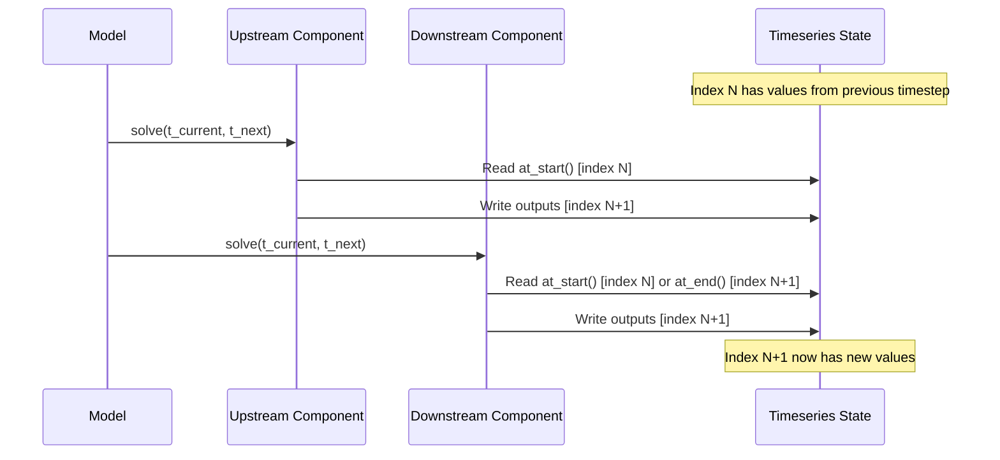

# Key Concepts

This page explains the core abstractions in RSCM: **Components**, **Models**, and **Timeseries**.

See the [Python API](api/rscm/) for full class documentation.

## Components

Components are the fundamental building blocks of RSCM.
Each component encapsulates a specific piece of physics (e.g., carbon cycle, radiative forcing, temperature response) that can be solved for a given timestep.

### What Components Do

A component:

- **Declares requirements**: Specifies what inputs it needs and what outputs it produces
- **Implements physics**: Contains the equations or algorithms for a particular process
- **Exchanges state**: Reads inputs from other components or exogenous data, writes outputs for downstream components

### Requirement Types

Each variable in a component has a **requirement type** that defines how it flows through the model:

| Type     | Description                                                     | Read | Write |
| -------- | --------------------------------------------------------------- | ---- | ----- |
| `Input`  | External data or output from another component                  | Yes  | No    |
| `Output` | New value produced each timestep                                | No   | Yes   |
| `State`  | Reads previous value, writes new value (requires initial value) | Yes  | Yes   |

### Component Lifecycle


1. **Definition phase**: The component declares its inputs and outputs via `definitions()`
2. **Build phase**: The model builder validates that all requirements can be satisfied
3. **Solve phase**: At each timestep, `solve(t_current, t_next, input_state)` is called

### Creating Components in Python

Use [`Component`][rscm.component.Component] with [`Input`][rscm.component.Input], [`Output`][rscm.component.Output], and [`State`][rscm.component.State] descriptors:

```python
from rscm.component import Component, Input, Output, State

class SimpleCarbonCycle(Component):
    # Declare requirements using descriptors
    emissions = Input("Emissions|CO2", unit="GtCO2")
    concentration = State("Atmospheric Concentration|CO2", unit="ppm")
    uptake = Output("Land Uptake|CO2", unit="GtC")

    def __init__(self, sensitivity: float):
        self.sensitivity = sensitivity

    def solve(self, t_current, t_next, inputs):
        # Access values at start of timestep (index N)
        emis = inputs.emissions.at_start()
        conc_prev = inputs.concentration.at_start()

        # Compute new values
        new_conc = conc_prev + emis * self.sensitivity
        uptake_val = emis * 0.3

        # Return typed outputs
        return self.Outputs(concentration=new_conc, uptake=uptake_val)
```

### Creating Components in Rust

```rust
use rscm_core::{ComponentIO, component::{Component, InputState, OutputState}};
use serde::{Serialize, Deserialize};

#[derive(Debug, Serialize, Deserialize, ComponentIO)]
#[inputs(
    emissions { name = "Emissions|CO2", unit = "GtCO2" },
)]
#[states(
    concentration { name = "Atmospheric Concentration|CO2", unit = "ppm" },
)]
#[outputs(
    uptake { name = "Land Uptake|CO2", unit = "GtC" },
)]
pub struct SimpleCarbonCycle {
    pub sensitivity: f64,
}

#[typetag::serde]
impl Component for SimpleCarbonCycle {
    fn definitions(&self) -> Vec<RequirementDefinition> {
        Self::generated_definitions()
    }

    fn solve(&self, t_current: Time, t_next: Time, input_state: &InputState)
        -> RSCMResult<OutputState>
    {
        let inputs = SimpleCarbonCycleInputs::from_input_state(input_state);

        let emis = inputs.emissions.at_start();
        let conc_prev = inputs.concentration.at_start();

        let outputs = SimpleCarbonCycleOutputs {
            concentration: conc_prev + emis * self.sensitivity,
            uptake: emis * 0.3,
        };
        Ok(outputs.into())
    }
}
```

## Models

A **Model** couples multiple components together, managing the flow of state between them and stepping through time.

### ModelBuilder Pattern

Models are constructed using the [`ModelBuilder`][rscm.core.ModelBuilder] pattern:

```python
from rscm.core import ModelBuilder, TimeAxis, Timeseries
import numpy as np

model = (
    ModelBuilder()
    .with_time_axis(TimeAxis.from_values(np.arange(1750, 2101, 1.0)))
    .with_rust_component(carbon_cycle)
    .with_rust_component(temperature_response)
    .with_exogenous_variable("Emissions|CO2", emissions_ts)
    .with_initial_values({"Atmospheric Concentration|CO2": 280.0})
).build()
```

### Dependency Graph

When you add components to a model, the builder constructs a **dependency graph**:

1. Each component becomes a node in the graph
2. Edges connect components that share variables (producer -> consumer)
3. The graph must be acyclic (no circular dependencies between components)
4. Self-referential state variables are allowed (a component reading its own previous output)

### Model Execution

The model solves components in dependency order using breadth-first search (BFS):


### Running a Model

```python
# Step through one timestep at a time
model.step()
print(f"Current time: {model.current_time_bounds()}")

# Or run to completion
model.run()

# Access results
results = model.timeseries()
temp = results.get_timeseries_by_name("Surface Temperature")
```

### Exogenous vs Endogenous Variables

| Variable Type  | Source                       | Example                                 |
| -------------- | ---------------------------- | --------------------------------------- |
| **Exogenous**  | Provided externally          | Emissions scenarios, prescribed forcing |
| **Endogenous** | Computed by model components | CO2 concentration, temperature          |

Whether a variable is exogenous or endogenous is determined by the components in the model, not by any intrinsic property of the variable itself. During the build phase, the `ModelBuilder` analyses all component definitions to identify:

1. **Required inputs**: Variables that components need to read
2. **Produced outputs**: Variables that components write

Any required input that is not produced by another component in the model must be supplied as exogenous data via `with_exogenous_variable()`. The same variable can be exogenous in one model configuration and endogenous in another, depending on which components are included.

For example, CO2 concentration might be:

- **Endogenous** in a full carbon-cycle model where a component calculates concentration from emissions
- **Exogenous** in a temperature-only model where concentration is prescribed directly

The builder will raise an error if any required inputs cannot be satisfied by either component outputs or exogenous data.

## Timeseries

RSCM uses [`Timeseries`][rscm.core.Timeseries] objects to represent time-varying data with support for different interpolation strategies.

### TimeAxis

A `TimeAxis` defines the temporal grid for a timeseries:

```python
from rscm.core import TimeAxis
import numpy as np

# From values (assumes uniform spacing for last step)
time_axis = TimeAxis.from_values(np.arange(2000.0, 2101.0, 1.0))

# From explicit bounds (n+1 bounds for n timesteps)
time_axis = TimeAxis.from_bounds(np.array([2000.0, 2010.0, 2050.0, 2100.0]))
```

### Timeseries

A `Timeseries` combines values, time axis, units, and interpolation strategy:

```python
from rscm.core import Timeseries, InterpolationStrategy

emissions = Timeseries(
    values=np.array([0.0, 10.0, 15.0]),
    time_axis=TimeAxis.from_values(np.array([1850.0, 2000.0, 2100.0])),
    units="GtC / yr",
    interpolation_strategy=InterpolationStrategy.Linear,
)
```

### Interpolation Strategies

When the model time axis differs from the timeseries time axis, values are interpolated according to the `InterpolationStrategy`:

| Strategy   | Behaviour                                     |
| ---------- | --------------------------------------------- |
| `Linear`   | Linear interpolation between points (default) |
| `Previous` | Step function using the previous value        |
| `Next`     | Step function using the next value            |


### TimeseriesCollection

A [`TimeseriesCollection`][rscm.core.TimeseriesCollection] holds multiple named timeseries:

```python
from rscm.core import TimeseriesCollection

collection = TimeseriesCollection()
collection.add_timeseries("Emissions|CO2", emissions_ts)
collection.add_timeseries("Surface Temperature", temp_ts)

# Access by name
ts = collection.get_timeseries_by_name("Emissions|CO2")
print(ts.values())
```

### Input Access in Components

Within a component's `solve()` method, inputs are accessed via `TimeseriesWindow`. The key methods are `at_start()` and `at_end()`, which correspond to different points in the timestep execution:

```python
def solve(self, t_current, t_next, inputs):
    # Value at start of timestep (index N) - use for state variables and exogenous inputs
    value = inputs.emissions.at_start()

    # Value at end of timestep (index N+1) - use for upstream component outputs
    # Returns None if at the last timestep
    upstream_value = inputs.forcing.at_end()

    # Previous timestep's value (index N-1)
    previous = inputs.emissions.previous

    # Value at relative offset (-2 = two steps back)
    historical = inputs.emissions.at_offset(-2)

    # Array of last n values
    history = inputs.emissions.last_n(5)
```

See [Timestep Semantics](#timestep-semantics) for detailed guidance on when to use each accessor.

## Variable Schema

A **VariableSchema** declares model variables and their aggregation relationships, enabling derived values to be computed automatically from multiple component outputs.

### Why Use Variable Schema?

When building climate models, you often need to aggregate multiple forcing agents into totals:

- Sum CO2, CH4, and N2O forcing into "GHG Forcing"
- Compute weighted averages across regions
- Build hierarchical aggregates (e.g., "Total Forcing" from sub-totals)

Without a schema, you'd need to write custom aggregation components. With VariableSchema, you declare the relationships and RSCM handles the rest.

### Declaring a Schema

```python
from rscm.core import VariableSchema

schema = (
    VariableSchema()
    # Declare individual variables
    .add_variable("ERF|CO2", "W/m^2")
    .add_variable("ERF|CH4", "W/m^2")
    .add_variable("ERF|N2O", "W/m^2")
    # Declare an aggregate
    .add_aggregate("ERF|GHG", "W/m^2", "Sum")
        .from_variable("ERF|CO2")
        .from_variable("ERF|CH4")
        .from_variable("ERF|N2O")
        .build()
)
```

### Aggregation Operations

| Operation  | Description                         |
| ---------- | ----------------------------------- |
| `Sum`      | Sum of all contributors             |
| `Mean`     | Arithmetic mean                     |
| `Weighted` | Weighted average (requires weights) |

### Using Schema with ModelBuilder

```python
model = (
    ModelBuilder()
    .with_time_axis(time_axis)
    .with_schema(schema)
    .with_rust_component(co2_forcing)
    .with_rust_component(ch4_forcing)
    .with_rust_component(n2o_forcing)
    # ... exogenous data and initial values
).build()
```

During build, RSCM:

1. Validates that all aggregate contributors exist
2. Checks for circular dependencies
3. Inserts virtual aggregator components into the dependency graph
4. Ensures unit consistency between contributors and aggregates

### Key Behaviours

- **NaN handling**: Contributors with NaN values are excluded from computation (treated as missing data)
- **Hierarchical aggregates**: Aggregates can reference other aggregates as contributors
- **Partial models**: Schema variables with no writer component remain NaN

For a complete walkthrough, see [Tutorial 3: Variable Schemas](tutorials.md#tutorial-3-variable-schemas).

## Timestep Semantics

Understanding when to use `at_start()` vs `at_end()` is crucial for correctly reading values in component `solve()` methods. These accessors correspond to different points in the model's timestep execution.

### Execution Model

During each timestep, the model:

1. Sets the current time index to N (pointing to `t_current`)
2. Solves components in dependency order (upstream before downstream)
3. Each component writes its outputs to index N+1 (corresponding to `t_next`)
4. After all components complete, advances to the next timestep



### When to Use `at_start()`

Use `at_start()` to read values at index N (the start of the current timestep):

| Variable Type | Who Wrote It | When Written |
|---------------|--------------|--------------|
| **State variables** | You (same component) | Previous timestep |
| **Exogenous inputs** | External data | Pre-populated before run |

**Example - Reading your own state:**

```python
class TemperatureComponent(Component):
    temperature = State("Temperature", unit="K")
    forcing = Input("Forcing", unit="W/m^2")

    def solve(self, t_current, t_next, inputs):
        # Read YOUR previous temperature (you wrote this last timestep)
        temp_prev = inputs.temperature.at_start()
        forcing = inputs.forcing.at_start()

        # Compute new temperature
        new_temp = temp_prev + forcing * 0.5

        return self.Outputs(temperature=new_temp)
```

### When to Use `at_end()`

Use `at_end()` to read values at index N+1 (written by upstream components during this timestep):

| Variable Type | Who Wrote It | When Written |
|---------------|--------------|--------------|
| **Upstream outputs** | Other component | This timestep (before you ran) |

**Example - Reading upstream component output:**

```python
class ClimateResponse(Component):
    # ERF is computed by an upstream ForcingComponent
    effective_radiative_forcing = Input("ERF", unit="W/m^2")
    temperature = State("Temperature", unit="K")

    def solve(self, t_current, t_next, inputs):
        temp_prev = inputs.temperature.at_start()  # Your own state

        # Read forcing written by upstream component THIS timestep
        # Falls back to at_start() if at final timestep (at_end returns None)
        erf = inputs.effective_radiative_forcing.at_end()
        if erf is None:
            erf = inputs.effective_radiative_forcing.at_start()

        new_temp = temp_prev + erf * self.sensitivity

        return self.Outputs(temperature=new_temp)
```

### Quick Reference

| What you're reading | Who wrote it | Method |
|---------------------|--------------|--------|
| Your own previous state | You, last timestep | `at_start()` |
| Exogenous input (external forcing) | Pre-populated | `at_start()` |
| Upstream component output | They ran this timestep | `at_end()` |

### Grid Variables

For grid-based variables (`FourBox` or `Hemispheric`), the same semantics apply with region-specific access:

```python
# Scalar window
value = inputs.temperature.at_start()
value = inputs.temperature.at_end()  # Returns None at last timestep

# Grid window - single region
value = inputs.regional_temp.at_start(region=0)  # Northern ocean
value = inputs.regional_temp.at_end(region=1)    # Northern land

# Grid window - all regions at once
slice = inputs.regional_temp.current_all_at_start()  # Returns FourBoxSlice
slice = inputs.regional_temp.current_all_at_end()    # Returns FourBoxSlice or None
```

### Handling the Final Timestep

`at_end()` returns `None` when at the final timestep (there is no index N+1). Handle this with a fallback:

```python
def solve(self, t_current, t_next, inputs):
    # Pattern: try at_end, fall back to at_start
    erf = inputs.forcing.at_end()
    if erf is None:
        erf = inputs.forcing.at_start()

    # Or using Python's or operator (if 0.0 is not a valid fallback)
    erf = inputs.forcing.at_end() or inputs.forcing.at_start()
```

## Putting It Together

Here's how the concepts connect in a complete workflow:


1. **Define components** with their inputs, outputs, and physics
2. **Build a model** using `ModelBuilder`, providing components, exogenous data, and initial values
3. **Run the model** to generate results
4. **Extract timeseries** for analysis and visualisation
